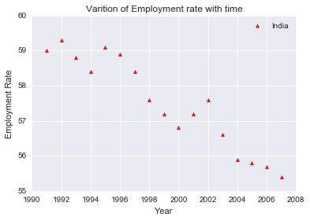
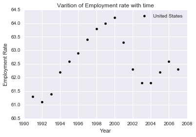

# Gapminder Data

In this Analysis we are going to use data from a different dataset 'Gapminder Data' -  
The data was obtained from the site [gapminder.org](http://www.gapminder.org/data/). The variables included are:

* Aged 15+ Employment Rate (%)
* Life Expectancy (years)
* GDP/capita (US$, inflation adjusted)
* Primary school completion (% of boys)
* Primary school completion (% of girls)


```python
## importing all the important libraries

#library useful for reading csv files though it's not useful in this file
import unicodecsv
#this packages improves the looks of the graphs
import seaborn as sns
#prevents graph from flowing out of the active window
%pylab inline         
#package for plotting conveniently
import matplotlib.pyplot as plt 
import numpy as np   # for handling arrays
import pandas as pd  #for handling dataframes
```

    Populating the interactive namespace from numpy and matplotlib
    


```python
# This was how we read csv file normally 
#def read_csv(filename):
#   with open(filename, 'rb') as f:
#        reader= unicodecsv.DictReader(f)
#        return list(reader)
#    

# But in this project we are going to do the same using pandas

employment_rate = pd.read_csv("employment_above_15.csv",index_col= 0)
life_expectancy = pd.read_csv("life_expectancy.csv",index_col= 0)
gdp_per_capita  = pd.read_csv("gdp_per_capita.csv",index_col= 0)
male_school_completion_rate = pd.read_csv("male_completion_rate.csv",index_col= 0)
female_school_completion_rate = pd.read_csv("female_completion_rate.csv",index_col= 0)

# index_col=0 initializes the 0th column as index
```


```python
employment_rate.head()

#dataframe.head() prints only the top 5 lines
```


<div>
<table border="1" class="dataframe">
  <thead>
    <tr style="text-align: right;">
      <th></th>
      <th>1991</th>
      <th>1992</th>
      <th>1993</th>
      <th>1994</th>
      <th>1995</th>
      <th>1996</th>
      <th>1997</th>
      <th>1998</th>
      <th>1999</th>
      <th>2000</th>
      <th>2001</th>
      <th>2002</th>
      <th>2003</th>
      <th>2004</th>
      <th>2005</th>
      <th>2006</th>
      <th>2007</th>
    </tr>
    <tr>
      <th>Country</th>
      <th></th>
      <th></th>
      <th></th>
      <th></th>
      <th></th>
      <th></th>
      <th></th>
      <th></th>
      <th></th>
      <th></th>
      <th></th>
      <th></th>
      <th></th>
      <th></th>
      <th></th>
      <th></th>
      <th></th>
    </tr>
  </thead>
  <tbody>
    <tr>
      <th>Afghanistan</th>
      <td>56.700001</td>
      <td>56.500000</td>
      <td>56.599998</td>
      <td>56.200001</td>
      <td>56.200001</td>
      <td>56.099998</td>
      <td>56.200001</td>
      <td>56.200001</td>
      <td>56.099998</td>
      <td>56.099998</td>
      <td>56.500000</td>
      <td>56.400002</td>
      <td>54.400002</td>
      <td>56.000000</td>
      <td>54.000000</td>
      <td>56.000000</td>
      <td>55.700001</td>
    </tr>
    <tr>
      <th>Albania</th>
      <td>52.700001</td>
      <td>52.299999</td>
      <td>52.400002</td>
      <td>52.700001</td>
      <td>52.799999</td>
      <td>52.599998</td>
      <td>52.400002</td>
      <td>52.099998</td>
      <td>52.099998</td>
      <td>51.900002</td>
      <td>51.799999</td>
      <td>51.799999</td>
      <td>51.799999</td>
      <td>51.700001</td>
      <td>51.500000</td>
      <td>51.400002</td>
      <td>51.400002</td>
    </tr>
    <tr>
      <th>Algeria</th>
      <td>39.400002</td>
      <td>38.900002</td>
      <td>39.400002</td>
      <td>39.400002</td>
      <td>38.099998</td>
      <td>38.900002</td>
      <td>39.700001</td>
      <td>39.500000</td>
      <td>39.400002</td>
      <td>38.599998</td>
      <td>40.400002</td>
      <td>41.500000</td>
      <td>42.799999</td>
      <td>46.400002</td>
      <td>48.000000</td>
      <td>50.000000</td>
      <td>50.500000</td>
    </tr>
    <tr>
      <th>Angola</th>
      <td>75.800003</td>
      <td>75.800003</td>
      <td>75.500000</td>
      <td>75.900002</td>
      <td>75.800003</td>
      <td>75.900002</td>
      <td>75.699997</td>
      <td>75.599998</td>
      <td>75.599998</td>
      <td>75.500000</td>
      <td>75.500000</td>
      <td>75.599998</td>
      <td>75.500000</td>
      <td>75.500000</td>
      <td>75.599998</td>
      <td>75.500000</td>
      <td>75.699997</td>
    </tr>
    <tr>
      <th>Argentina</th>
      <td>53.599998</td>
      <td>53.799999</td>
      <td>53.700001</td>
      <td>53.799999</td>
      <td>53.500000</td>
      <td>54.400002</td>
      <td>54.900002</td>
      <td>55.000000</td>
      <td>54.900002</td>
      <td>55.500000</td>
      <td>55.599998</td>
      <td>55.400002</td>
      <td>57.299999</td>
      <td>57.700001</td>
      <td>58.099998</td>
      <td>58.400002</td>
      <td>58.400002</td>
    </tr>
  </tbody>
</table>
</div>


```python
life_expectancy.head()
```


<div>
<table border="1" class="dataframe">
  <thead>
    <tr style="text-align: right;">
      <th></th>
      <th>1800</th>
      <th>1801</th>
      <th>1802</th>
      <th>1803</th>
      <th>1804</th>
      <th>1805</th>
      <th>1806</th>
      <th>1807</th>
      <th>1808</th>
      <th>1809</th>
      <th>...</th>
      <th>2004</th>
      <th>2005</th>
      <th>2006</th>
      <th>2007</th>
      <th>2008</th>
      <th>2009</th>
      <th>2010</th>
      <th>2011</th>
      <th>2012</th>
      <th>2013</th>
    </tr>
    <tr>
      <th>Country</th>
      <th></th>
      <th></th>
      <th></th>
      <th></th>
      <th></th>
      <th></th>
      <th></th>
      <th></th>
      <th></th>
      <th></th>
      <th></th>
      <th></th>
      <th></th>
      <th></th>
      <th></th>
      <th></th>
      <th></th>
      <th></th>
      <th></th>
      <th></th>
      <th></th>
    </tr>
  </thead>
  <tbody>
    <tr>
      <th>Afghanistan</th>
      <td>28.2110</td>
      <td>28.200753</td>
      <td>28.190507</td>
      <td>28.18026</td>
      <td>28.170013</td>
      <td>28.159767</td>
      <td>28.14952</td>
      <td>28.139273</td>
      <td>28.129027</td>
      <td>28.11878</td>
      <td>...</td>
      <td>52.5</td>
      <td>52.9</td>
      <td>53.2</td>
      <td>53.6</td>
      <td>54.0</td>
      <td>54.5</td>
      <td>54.8</td>
      <td>55.2</td>
      <td>55.5</td>
      <td>56.2</td>
    </tr>
    <tr>
      <th>Albania</th>
      <td>35.4000</td>
      <td>35.400000</td>
      <td>35.400000</td>
      <td>35.40000</td>
      <td>35.400000</td>
      <td>35.400000</td>
      <td>35.40000</td>
      <td>35.400000</td>
      <td>35.400000</td>
      <td>35.40000</td>
      <td>...</td>
      <td>74.4</td>
      <td>74.4</td>
      <td>74.5</td>
      <td>74.7</td>
      <td>74.9</td>
      <td>75.0</td>
      <td>75.2</td>
      <td>75.5</td>
      <td>75.7</td>
      <td>75.8</td>
    </tr>
    <tr>
      <th>Algeria</th>
      <td>28.8224</td>
      <td>28.822400</td>
      <td>28.822400</td>
      <td>28.82240</td>
      <td>28.822400</td>
      <td>28.822400</td>
      <td>28.82240</td>
      <td>28.822400</td>
      <td>28.822400</td>
      <td>28.82240</td>
      <td>...</td>
      <td>74.2</td>
      <td>74.5</td>
      <td>74.8</td>
      <td>75.0</td>
      <td>75.3</td>
      <td>75.6</td>
      <td>75.9</td>
      <td>76.1</td>
      <td>76.2</td>
      <td>76.3</td>
    </tr>
    <tr>
      <th>American Samoa</th>
      <td>NaN</td>
      <td>NaN</td>
      <td>NaN</td>
      <td>NaN</td>
      <td>NaN</td>
      <td>NaN</td>
      <td>NaN</td>
      <td>NaN</td>
      <td>NaN</td>
      <td>NaN</td>
      <td>...</td>
      <td>NaN</td>
      <td>NaN</td>
      <td>NaN</td>
      <td>NaN</td>
      <td>NaN</td>
      <td>NaN</td>
      <td>NaN</td>
      <td>NaN</td>
      <td>NaN</td>
      <td>NaN</td>
    </tr>
    <tr>
      <th>Andorra</th>
      <td>NaN</td>
      <td>NaN</td>
      <td>NaN</td>
      <td>NaN</td>
      <td>NaN</td>
      <td>NaN</td>
      <td>NaN</td>
      <td>NaN</td>
      <td>NaN</td>
      <td>NaN</td>
      <td>...</td>
      <td>83.0</td>
      <td>83.1</td>
      <td>83.2</td>
      <td>83.4</td>
      <td>83.5</td>
      <td>83.6</td>
      <td>83.7</td>
      <td>83.8</td>
      <td>83.8</td>
      <td>83.9</td>
    </tr>
  </tbody>
</table>
<p>5 rows × 205 columns</p>
</div>


```python
gdp_per_capita.head()
```


<div>
<table border="1" class="dataframe">
  <thead>
    <tr style="text-align: right;">
      <th></th>
      <th>1960</th>
      <th>1961</th>
      <th>1962</th>
      <th>1963</th>
      <th>1964</th>
      <th>1965</th>
      <th>1966</th>
      <th>1967</th>
      <th>1968</th>
      <th>1969</th>
      <th>...</th>
      <th>2002</th>
      <th>2003</th>
      <th>2004</th>
      <th>2005</th>
      <th>2006</th>
      <th>2007</th>
      <th>2008</th>
      <th>2009</th>
      <th>2010</th>
      <th>2011</th>
    </tr>
    <tr>
      <th>Country</th>
      <th></th>
      <th></th>
      <th></th>
      <th></th>
      <th></th>
      <th></th>
      <th></th>
      <th></th>
      <th></th>
      <th></th>
      <th></th>
      <th></th>
      <th></th>
      <th></th>
      <th></th>
      <th></th>
      <th></th>
      <th></th>
      <th></th>
      <th></th>
      <th></th>
    </tr>
  </thead>
  <tbody>
    <tr>
      <th>Abkhazia</th>
      <td>NaN</td>
      <td>NaN</td>
      <td>NaN</td>
      <td>NaN</td>
      <td>NaN</td>
      <td>NaN</td>
      <td>NaN</td>
      <td>NaN</td>
      <td>NaN</td>
      <td>NaN</td>
      <td>...</td>
      <td>NaN</td>
      <td>NaN</td>
      <td>NaN</td>
      <td>NaN</td>
      <td>NaN</td>
      <td>NaN</td>
      <td>NaN</td>
      <td>NaN</td>
      <td>NaN</td>
      <td>NaN</td>
    </tr>
    <tr>
      <th>Afghanistan</th>
      <td>NaN</td>
      <td>NaN</td>
      <td>NaN</td>
      <td>NaN</td>
      <td>NaN</td>
      <td>NaN</td>
      <td>NaN</td>
      <td>NaN</td>
      <td>NaN</td>
      <td>NaN</td>
      <td>...</td>
      <td>NaN</td>
      <td>NaN</td>
      <td>NaN</td>
      <td>NaN</td>
      <td>NaN</td>
      <td>NaN</td>
      <td>NaN</td>
      <td>NaN</td>
      <td>NaN</td>
      <td>NaN</td>
    </tr>
    <tr>
      <th>Akrotiri and Dhekelia</th>
      <td>NaN</td>
      <td>NaN</td>
      <td>NaN</td>
      <td>NaN</td>
      <td>NaN</td>
      <td>NaN</td>
      <td>NaN</td>
      <td>NaN</td>
      <td>NaN</td>
      <td>NaN</td>
      <td>...</td>
      <td>NaN</td>
      <td>NaN</td>
      <td>NaN</td>
      <td>NaN</td>
      <td>NaN</td>
      <td>NaN</td>
      <td>NaN</td>
      <td>NaN</td>
      <td>NaN</td>
      <td>NaN</td>
    </tr>
    <tr>
      <th>Albania</th>
      <td>NaN</td>
      <td>NaN</td>
      <td>NaN</td>
      <td>NaN</td>
      <td>NaN</td>
      <td>NaN</td>
      <td>NaN</td>
      <td>NaN</td>
      <td>NaN</td>
      <td>NaN</td>
      <td>...</td>
      <td>1313.722725</td>
      <td>1381.040832</td>
      <td>1454.022854</td>
      <td>1525.723589</td>
      <td>1594.495067</td>
      <td>1681.613910</td>
      <td>1804.419415</td>
      <td>1857.352947</td>
      <td>1915.424459</td>
      <td>1965.707230</td>
    </tr>
    <tr>
      <th>Algeria</th>
      <td>1280.384828</td>
      <td>1085.414612</td>
      <td>855.947986</td>
      <td>1128.41578</td>
      <td>1170.323896</td>
      <td>1215.015783</td>
      <td>1127.614288</td>
      <td>1200.558225</td>
      <td>1291.863983</td>
      <td>1359.491003</td>
      <td>...</td>
      <td>1871.921986</td>
      <td>1971.512803</td>
      <td>2043.135713</td>
      <td>2115.186028</td>
      <td>2124.957754</td>
      <td>2155.485231</td>
      <td>2173.787903</td>
      <td>2192.703976</td>
      <td>2231.980246</td>
      <td>2255.225482</td>
    </tr>
  </tbody>
</table>
<p>5 rows × 52 columns</p>
</div>


```python
male_school_completion_rate .head()
```


<div>
<table border="1" class="dataframe">
  <thead>
    <tr style="text-align: right;">
      <th></th>
      <th>1970</th>
      <th>1971</th>
      <th>1972</th>
      <th>1973</th>
      <th>1974</th>
      <th>1975</th>
      <th>1976</th>
      <th>1977</th>
      <th>1978</th>
      <th>1979</th>
      <th>...</th>
      <th>2002</th>
      <th>2003</th>
      <th>2004</th>
      <th>2005</th>
      <th>2006</th>
      <th>2007</th>
      <th>2008</th>
      <th>2009</th>
      <th>2010</th>
      <th>2011</th>
    </tr>
    <tr>
      <th>Country</th>
      <th></th>
      <th></th>
      <th></th>
      <th></th>
      <th></th>
      <th></th>
      <th></th>
      <th></th>
      <th></th>
      <th></th>
      <th></th>
      <th></th>
      <th></th>
      <th></th>
      <th></th>
      <th></th>
      <th></th>
      <th></th>
      <th></th>
      <th></th>
      <th></th>
    </tr>
  </thead>
  <tbody>
    <tr>
      <th>Abkhazia</th>
      <td>NaN</td>
      <td>NaN</td>
      <td>NaN</td>
      <td>NaN</td>
      <td>NaN</td>
      <td>NaN</td>
      <td>NaN</td>
      <td>NaN</td>
      <td>NaN</td>
      <td>NaN</td>
      <td>...</td>
      <td>NaN</td>
      <td>NaN</td>
      <td>NaN</td>
      <td>NaN</td>
      <td>NaN</td>
      <td>NaN</td>
      <td>NaN</td>
      <td>NaN</td>
      <td>NaN</td>
      <td>NaN</td>
    </tr>
    <tr>
      <th>Afghanistan</th>
      <td>NaN</td>
      <td>NaN</td>
      <td>NaN</td>
      <td>NaN</td>
      <td>26.23178</td>
      <td>NaN</td>
      <td>NaN</td>
      <td>26.73849</td>
      <td>29.07336</td>
      <td>NaN</td>
      <td>...</td>
      <td>NaN</td>
      <td>NaN</td>
      <td>NaN</td>
      <td>48.36070</td>
      <td>NaN</td>
      <td>NaN</td>
      <td>NaN</td>
      <td>NaN</td>
      <td>NaN</td>
      <td>NaN</td>
    </tr>
    <tr>
      <th>Akrotiri and Dhekelia</th>
      <td>NaN</td>
      <td>NaN</td>
      <td>NaN</td>
      <td>NaN</td>
      <td>NaN</td>
      <td>NaN</td>
      <td>NaN</td>
      <td>NaN</td>
      <td>NaN</td>
      <td>NaN</td>
      <td>...</td>
      <td>NaN</td>
      <td>NaN</td>
      <td>NaN</td>
      <td>NaN</td>
      <td>NaN</td>
      <td>NaN</td>
      <td>NaN</td>
      <td>NaN</td>
      <td>NaN</td>
      <td>NaN</td>
    </tr>
    <tr>
      <th>Albania</th>
      <td>NaN</td>
      <td>NaN</td>
      <td>NaN</td>
      <td>NaN</td>
      <td>NaN</td>
      <td>NaN</td>
      <td>NaN</td>
      <td>NaN</td>
      <td>NaN</td>
      <td>NaN</td>
      <td>...</td>
      <td>NaN</td>
      <td>101.90853</td>
      <td>99.10666</td>
      <td>NaN</td>
      <td>NaN</td>
      <td>NaN</td>
      <td>89.44897</td>
      <td>88.83622</td>
      <td>86.49044</td>
      <td>88.18113</td>
    </tr>
    <tr>
      <th>Algeria</th>
      <td>NaN</td>
      <td>NaN</td>
      <td>55.3917</td>
      <td>57.41252</td>
      <td>60.71733</td>
      <td>66.29215</td>
      <td>72.58079</td>
      <td>75.04380</td>
      <td>77.39284</td>
      <td>76.08493</td>
      <td>...</td>
      <td>90.34439</td>
      <td>92.04006</td>
      <td>92.68131</td>
      <td>94.66572</td>
      <td>NaN</td>
      <td>95.47622</td>
      <td>121.33472</td>
      <td>93.16440</td>
      <td>96.09082</td>
      <td>94.51607</td>
    </tr>
  </tbody>
</table>
<p>5 rows × 42 columns</p>
</div>


```python
female_school_completion_rate.head()
```


<div>
<table border="1" class="dataframe">
  <thead>
    <tr style="text-align: right;">
      <th></th>
      <th>1970</th>
      <th>1971</th>
      <th>1972</th>
      <th>1973</th>
      <th>1974</th>
      <th>1975</th>
      <th>1976</th>
      <th>1977</th>
      <th>1978</th>
      <th>1979</th>
      <th>...</th>
      <th>2002</th>
      <th>2003</th>
      <th>2004</th>
      <th>2005</th>
      <th>2006</th>
      <th>2007</th>
      <th>2008</th>
      <th>2009</th>
      <th>2010</th>
      <th>2011</th>
    </tr>
    <tr>
      <th>Country</th>
      <th></th>
      <th></th>
      <th></th>
      <th></th>
      <th></th>
      <th></th>
      <th></th>
      <th></th>
      <th></th>
      <th></th>
      <th></th>
      <th></th>
      <th></th>
      <th></th>
      <th></th>
      <th></th>
      <th></th>
      <th></th>
      <th></th>
      <th></th>
      <th></th>
    </tr>
  </thead>
  <tbody>
    <tr>
      <th>Abkhazia</th>
      <td>NaN</td>
      <td>NaN</td>
      <td>NaN</td>
      <td>NaN</td>
      <td>NaN</td>
      <td>NaN</td>
      <td>NaN</td>
      <td>NaN</td>
      <td>NaN</td>
      <td>NaN</td>
      <td>...</td>
      <td>NaN</td>
      <td>NaN</td>
      <td>NaN</td>
      <td>NaN</td>
      <td>NaN</td>
      <td>NaN</td>
      <td>NaN</td>
      <td>NaN</td>
      <td>NaN</td>
      <td>NaN</td>
    </tr>
    <tr>
      <th>Afghanistan</th>
      <td>NaN</td>
      <td>NaN</td>
      <td>NaN</td>
      <td>NaN</td>
      <td>4.19285</td>
      <td>NaN</td>
      <td>NaN</td>
      <td>5.14529</td>
      <td>5.91965</td>
      <td>NaN</td>
      <td>...</td>
      <td>NaN</td>
      <td>NaN</td>
      <td>NaN</td>
      <td>18.74188</td>
      <td>NaN</td>
      <td>NaN</td>
      <td>NaN</td>
      <td>NaN</td>
      <td>NaN</td>
      <td>NaN</td>
    </tr>
    <tr>
      <th>Akrotiri and Dhekelia</th>
      <td>NaN</td>
      <td>NaN</td>
      <td>NaN</td>
      <td>NaN</td>
      <td>NaN</td>
      <td>NaN</td>
      <td>NaN</td>
      <td>NaN</td>
      <td>NaN</td>
      <td>NaN</td>
      <td>...</td>
      <td>NaN</td>
      <td>NaN</td>
      <td>NaN</td>
      <td>NaN</td>
      <td>NaN</td>
      <td>NaN</td>
      <td>NaN</td>
      <td>NaN</td>
      <td>NaN</td>
      <td>NaN</td>
    </tr>
    <tr>
      <th>Albania</th>
      <td>NaN</td>
      <td>NaN</td>
      <td>NaN</td>
      <td>NaN</td>
      <td>NaN</td>
      <td>NaN</td>
      <td>NaN</td>
      <td>NaN</td>
      <td>NaN</td>
      <td>NaN</td>
      <td>...</td>
      <td>NaN</td>
      <td>100.27718</td>
      <td>97.70814</td>
      <td>NaN</td>
      <td>NaN</td>
      <td>NaN</td>
      <td>90.41091</td>
      <td>89.76010</td>
      <td>86.01452</td>
      <td>89.53901</td>
    </tr>
    <tr>
      <th>Algeria</th>
      <td>NaN</td>
      <td>NaN</td>
      <td>30.90031</td>
      <td>33.02938</td>
      <td>34.32702</td>
      <td>39.7942</td>
      <td>45.24156</td>
      <td>48.22515</td>
      <td>50.49138</td>
      <td>51.07383</td>
      <td>...</td>
      <td>90.09179</td>
      <td>91.27633</td>
      <td>93.30839</td>
      <td>94.21432</td>
      <td>NaN</td>
      <td>97.35583</td>
      <td>109.72854</td>
      <td>95.13346</td>
      <td>95.87439</td>
      <td>94.20928</td>
    </tr>
  </tbody>
</table>
<p>5 rows × 42 columns</p>
</div>


```python
female_school_completion_rate.loc['United States'].values.astype('str')

```


    array(['nan', 'nan', 'nan', 'nan', 'nan', 'nan', 'nan', 'nan', 'nan',
           'nan', 'nan', 'nan', 'nan', 'nan', 'nan', 'nan', 'nan', 'nan',
           'nan', 'nan', 'nan', 'nan', 'nan', 'nan', 'nan', 'nan', 'nan',
           'nan', '103.01365', '102.05438', '98.64533', '101.04295',
           '102.61931', '103.75253', '100.26424', '96.14198', '99.09253',
           '101.44458', '102.04852', '99.53498', '103.99037', 'nan'], 
          dtype='|S32')


### Questions that we ask here are-

1) How has employment in U.S. And India varied over time?

2) Which are the highest and lowest employment levels?
  * Which country have them?
  * Where is U.S. on the spectrum?
  
3) Are there any constant trend among countries?

### How the employment of countries varied over time?


```python
# defining functions for finding correlation 
def correlation(x,y):
    std_x = (x-x.mean())/(x.std(ddof = 0))
    std_y = (y-y.mean())/(y.std(ddof=0))
    
    return (std_x * std_y).mean()


def emp_country(country,df):
    emp_country=df.loc[country]
    year_are=df.columns.values.astype(str).astype(int)
    return correlation(emp_country.values, year_are)


```


```python
# Defining functions for drawing Scatter plots
year_for_country=employment_rate.columns.values.astype(str).astype(int)
emp_US=employment_rate.loc['United States']

def scatter_plot(df,country,clr, mrkr):
    yr_for_total = df.columns.values.astype(str).astype(int)
    emp_country_wise= df.loc[country]
    plt.scatter(yr_for_total,emp_country_wise,
    #color
    color=clr,
    #marker
    marker=mrkr)
    # Chart title
    plt.title('Varition of Employment rate with time')
    # y label
    plt.ylabel('Employment Rate')
    # x label
    plt.xlabel('Year')
    # and a legend
    plt.legend(loc='upper right')
    
    
    
    

scatter_plot(employment_rate, 'India','red','^')

```





```python
emp_country('India',employment_rate) #finding the correlation of employment rate in India with time 
```


    -0.9519721316199079


**
Such a highly value shows that there is a clear negative correlation between the two variables.  
That is employment rate in India decreased with increase in time and Vice-versa**


```python
scatter_plot(employment_rate, 'United States','black','o')

```





**Thus it appears like employment for U.S. increased from the year 1992 to 2000. And then it again it started to decrease until 2003 when due to some reason it again started increasing.**


```python
emp_country('United States',employment_rate)
```


    0.21615801555032632


**Also as it clear from the graph,and also from the value obtained the correlation is not very strong between the time employment rate for United States**

Now I want to know Specifically which countries follow a trend with time. For that let us find as which countries show a correlation with time greater such that |correlation| >= 


```python
def determing_cor_level(data):
    data1 = abs(data)
    if data1 < 0.4:
        return "Low"
    elif data1 < 0.7:
        return "Medium"
    else:
        return "High"

def corr_type(data):
    if data > 0:
        return "(-)ve"
    elif data == 0:
        return "Null"
    else:
        return "(+)ve"
    
def finding_corr(df):
    corr_list=[]
    corr_level=[]
    corr_types=[]
    for country in df.index.values.astype('str'):
        corr_value=emp_country(country,df)
        corr_list.append(corr_value)
        corr_level.append(determing_cor_level(corr_value))
        corr_types.append(corr_type(corr_value))
    df1= pd.DataFrame({'Correlation': corr_list,'Correlation Strength':corr_level, 'Correlation Type' : corr_types} ,
                      index= df.index.values.astype('str'))
    return df1

finding_corr(employment_rate).head()
```


<div>
<table border="1" class="dataframe">
  <thead>
    <tr style="text-align: right;">
      <th></th>
      <th>Correlation</th>
      <th>Correlation Strength</th>
      <th>Correlation Type</th>
    </tr>
  </thead>
  <tbody>
    <tr>
      <th>Afghanistan</th>
      <td>-0.580820</td>
      <td>Medium</td>
      <td>(+)ve</td>
    </tr>
    <tr>
      <th>Albania</th>
      <td>-0.925576</td>
      <td>High</td>
      <td>(+)ve</td>
    </tr>
    <tr>
      <th>Algeria</th>
      <td>0.830397</td>
      <td>High</td>
      <td>(-)ve</td>
    </tr>
    <tr>
      <th>Angola</th>
      <td>-0.583829</td>
      <td>Medium</td>
      <td>(+)ve</td>
    </tr>
    <tr>
      <th>Argentina</th>
      <td>0.951878</td>
      <td>High</td>
      <td>(-)ve</td>
    </tr>
  </tbody>
</table>
</div>


Now I wish to separate these into different strata based on their correlation strength.i.e into "low", "Medium", "High"


```python
finding_corr(employment_rate).groupby('Correlation Strength').count()['Correlation']
```


    Correlation Strength
    High      99
    Low       29
    Medium    50
    Name: Correlation, dtype: int64


```python
finding_corr(employment_rate).groupby('Correlation Type').count()['Correlation']
```


    Correlation Type
    (+)ve    79
    (-)ve    99
    Name: Correlation, dtype: int64


**Thus we find that out of 178 countries- 99 countries have high correlation between employment rate and time, 50 have medium and rest 29 have low correlation**

*****************************************************************************************************************

### Which are the highest and lowest employment levels?


```python
##Year_wise max-values are as follows
employment_rate.apply(argmax).values.astype(str)


```


    array(['Tanzania', 'Tanzania', 'Rwanda', 'Rwanda', 'Rwanda', 'Rwanda',
           'Rwanda', 'Tanzania', 'Tanzania', 'Tanzania', 'Burundi', 'Burundi',
           'Burundi', 'Burundi', 'Madagascar', 'Madagascar', 'Burundi'], 
          dtype='|S10')


```python
employment_level_variation=pd.DataFrame({ 'Max Employment Each Year':employment_rate.max(),
    'Respective Countries' :employment_rate.apply(argmax)})
employment_level_variation
```


<div>
<table border="1" class="dataframe">
  <thead>
    <tr style="text-align: right;">
      <th></th>
      <th>Max Employment Each Year</th>
      <th>Respective Countries</th>
    </tr>
  </thead>
  <tbody>
    <tr>
      <th>1991</th>
      <td>87.500000</td>
      <td>Tanzania</td>
    </tr>
    <tr>
      <th>1992</th>
      <td>87.199997</td>
      <td>Tanzania</td>
    </tr>
    <tr>
      <th>1993</th>
      <td>87.000000</td>
      <td>Rwanda</td>
    </tr>
    <tr>
      <th>1994</th>
      <td>87.699997</td>
      <td>Rwanda</td>
    </tr>
    <tr>
      <th>1995</th>
      <td>87.300003</td>
      <td>Rwanda</td>
    </tr>
    <tr>
      <th>1996</th>
      <td>86.800003</td>
      <td>Rwanda</td>
    </tr>
    <tr>
      <th>1997</th>
      <td>86.099998</td>
      <td>Rwanda</td>
    </tr>
    <tr>
      <th>1998</th>
      <td>85.900002</td>
      <td>Tanzania</td>
    </tr>
    <tr>
      <th>1999</th>
      <td>85.699997</td>
      <td>Tanzania</td>
    </tr>
    <tr>
      <th>2000</th>
      <td>85.099998</td>
      <td>Tanzania</td>
    </tr>
    <tr>
      <th>2001</th>
      <td>84.300003</td>
      <td>Burundi</td>
    </tr>
    <tr>
      <th>2002</th>
      <td>84.000000</td>
      <td>Burundi</td>
    </tr>
    <tr>
      <th>2003</th>
      <td>83.599998</td>
      <td>Burundi</td>
    </tr>
    <tr>
      <th>2004</th>
      <td>83.400002</td>
      <td>Burundi</td>
    </tr>
    <tr>
      <th>2005</th>
      <td>84.300003</td>
      <td>Madagascar</td>
    </tr>
    <tr>
      <th>2006</th>
      <td>84.099998</td>
      <td>Madagascar</td>
    </tr>
    <tr>
      <th>2007</th>
      <td>83.199997</td>
      <td>Burundi</td>
    </tr>
  </tbody>
</table>
</div>


#### Which is the highest employment level throughout? Which country has it? 

     FOr this let us sort the above dataframe in descending order.


```python
sorted_employ=employment_level_variation.sort_values(by='Max Employment Each Year' , axis=0, ascending=False, inplace=False, kind='quicksort', na_position='last')

sorted_employ
```


<div>
<table border="1" class="dataframe">
  <thead>
    <tr style="text-align: right;">
      <th></th>
      <th>Max Employment Each Year</th>
      <th>Respective Countries</th>
    </tr>
  </thead>
  <tbody>
    <tr>
      <th>1994</th>
      <td>87.699997</td>
      <td>Rwanda</td>
    </tr>
    <tr>
      <th>1991</th>
      <td>87.500000</td>
      <td>Tanzania</td>
    </tr>
    <tr>
      <th>1995</th>
      <td>87.300003</td>
      <td>Rwanda</td>
    </tr>
    <tr>
      <th>1992</th>
      <td>87.199997</td>
      <td>Tanzania</td>
    </tr>
    <tr>
      <th>1993</th>
      <td>87.000000</td>
      <td>Rwanda</td>
    </tr>
    <tr>
      <th>1996</th>
      <td>86.800003</td>
      <td>Rwanda</td>
    </tr>
    <tr>
      <th>1997</th>
      <td>86.099998</td>
      <td>Rwanda</td>
    </tr>
    <tr>
      <th>1998</th>
      <td>85.900002</td>
      <td>Tanzania</td>
    </tr>
    <tr>
      <th>1999</th>
      <td>85.699997</td>
      <td>Tanzania</td>
    </tr>
    <tr>
      <th>2000</th>
      <td>85.099998</td>
      <td>Tanzania</td>
    </tr>
    <tr>
      <th>2001</th>
      <td>84.300003</td>
      <td>Burundi</td>
    </tr>
    <tr>
      <th>2005</th>
      <td>84.300003</td>
      <td>Madagascar</td>
    </tr>
    <tr>
      <th>2006</th>
      <td>84.099998</td>
      <td>Madagascar</td>
    </tr>
    <tr>
      <th>2002</th>
      <td>84.000000</td>
      <td>Burundi</td>
    </tr>
    <tr>
      <th>2003</th>
      <td>83.599998</td>
      <td>Burundi</td>
    </tr>
    <tr>
      <th>2004</th>
      <td>83.400002</td>
      <td>Burundi</td>
    </tr>
    <tr>
      <th>2007</th>
      <td>83.199997</td>
      <td>Burundi</td>
    </tr>
  </tbody>
</table>
</div>


```python
print "The highest employment level throughout is",employment_rate.values.max(),"and this was for",sorted_employ['Respective Countries'][0]
```

    The highest employment level throughout is 87.6999969482 and this was for Rwanda
    


